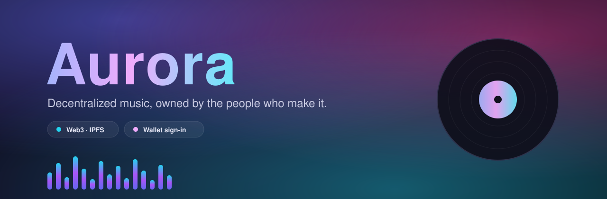
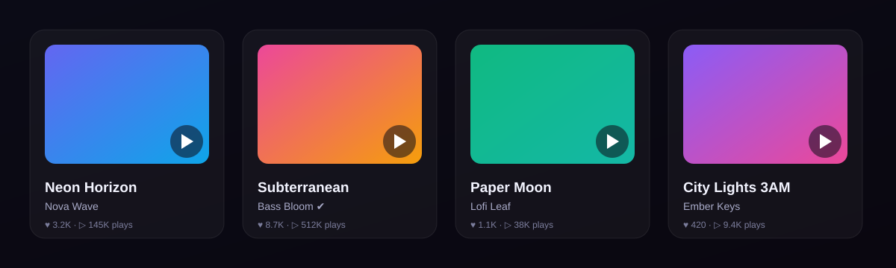

<div align="center">



<p>
  <a href="#-getting-started"></a>
  
  
  
  
  
</p>

**A decentralized music platform where artists upload, listeners discover, and creators get tipped — backed by IPFS and your wallet.**

</div>

---

## ✨ What is Aurora?

Aurora is a Web3 music-sharing app. Upload tracks, build playlists, post to a social feed, follow artists, and tip them in ETH. Content can live entirely in your browser or be pinned to **IPFS via Pinata** — there's no central backend to run. Connect a wallet, and you're in.

<div align="center">
  
</div>

## 🎧 Features

- **Stream & discover** — engagement-ranked feeds for trending tracks, viral sounds, and posts
- **Upload your sound** — drag-and-drop audio + cover art, stored locally or pinned to IPFS
- **A real player** — gapless two-deck **crossfade** engine, 10-band equalizer, live spectrum/waveform visualizers
- **Playlists & liked songs** — organize and revisit what you love
- **Social layer** — posts, comments, likes, follows, and notifications
- **Tip artists** — send ETH straight to a creator's wallet via MetaMask
- **Wallet sign-in** — onboarding flow keyed to your wallet address, no passwords
- **Light/dark, responsive** — built on Radix + Tailwind, works on mobile and desktop

## 🛠 Tech Stack

| Layer | Tools |
|-------|-------|
| UI | React 18, TypeScript, Tailwind CSS, shadcn/ui (Radix) |
| Build | Vite, SWC |
| Routing / state | React Router, React Query, Context providers |
| Audio | Web Audio API (dual-deck mixer, biquad EQ, analyser) |
| Web3 | MetaMask (EIP-1193), ETH transfers |
| Storage | Browser `localStorage` (default) · IPFS/Pinata (optional) |

## 🚀 Getting Started

**Prerequisites:** Node.js 18+, and the [MetaMask](https://metamask.io/) extension for wallet features.

```bash
git clone https://github.com/chxmq/aurora.git
cd aurora
npm install
cp .env.example .env   # optional — see below
npm run dev
```

Open **http://localhost:5173**. On first run the app seeds demo artists, tracks, and posts so there's something to play right away.

### Environment (optional)

Aurora runs fully on local storage out of the box. To persist uploads to IPFS, set these in `.env` and flip the flag:

```dotenv
VITE_ENABLE_PINATA=true
VITE_PINATA_JWT=your_jwt
VITE_PINATA_GATEWAY=https://<your-subdomain>.mypinata.cloud/ipfs/
```

Get keys from the [Pinata dashboard](https://app.pinata.cloud/keys). See [`.env.example`](.env.example) for all variables.

## 🧠 How it works

- **Local-first.** All data lives in `localStorage` behind a typed service layer, with cross-tab sync via storage events. IPFS/Pinata is an opt-in upgrade, not a requirement.
- **Two-deck audio engine.** `MusicPlayer` runs two `<audio>` elements through a Web Audio graph (`deck → gain → mix bus → EQ → analyser → master`). As a track ends, the next one fades in on the idle deck for true crossfades.
- **Ranking.** Feeds use engagement scoring with time-decay, plus diversity rules so one artist can't dominate. The recommendation/playlist helpers live in [`src/lib/algorithms.ts`](src/lib/algorithms.ts).

```
src/
  components/   # layout, music, post, playlist, user, search, ui
  pages/        # routes (Home, Explore, Profile, Playlists, …)
  providers/    # Wallet, Data, Storage contexts
  services/     # localStorage, ipfs, pinata, fileStorage
  lib/          # types, algorithms, config, mock seed data
```

## ⚠️ Good to know

This is a front-end-first project. A few things are intentionally simple and make great contribution targets:

- "Track NFT" is a label — there's **no smart contract**; tips are plain ETH transfers.
- Auth is a wallet address in `localStorage`, not a verified signature.
- Demo media loads from public CDNs (SoundHelix / Picsum / DiceBear).

## 🤝 Contributing

Contributions are welcome! Fork the repo, create a feature branch, and open a PR.

```bash
npm run lint     # check code style
npm run build    # type-check + production build
```

Please keep PRs focused and describe what you changed and how you tested it.

## 📄 License

[MIT](LICENSE) © chxmq and tallamSai

<div align="center">
<sub>Built with ♪ for an open music web.</sub>
</div>
